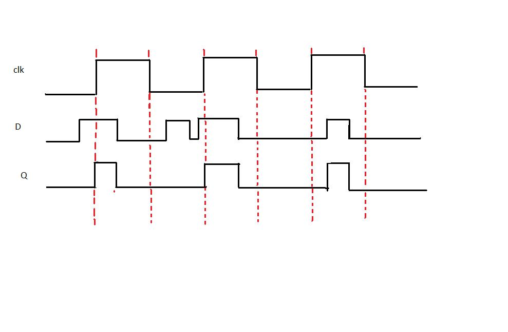
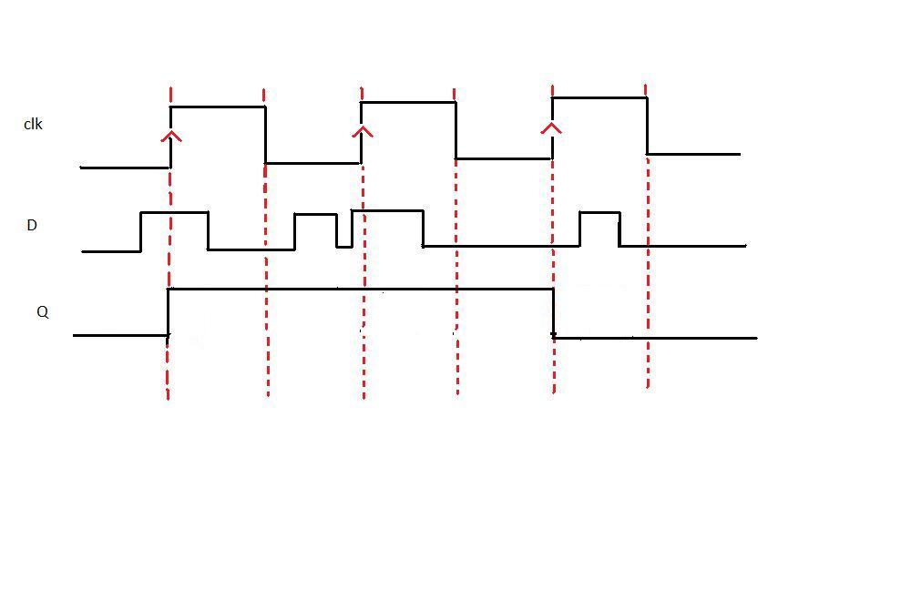

**Verilog**

Verilog is language commonly used in designing digital systems. It is a hardware description language, which means that it is substantially different from any other language you might have encountered so far. Even though it does have control flow statements and variables, it relies primarily on logic functions. It is a textual format for describing electronic circuits and systems.  

Verilog has evolved as a standard hardware description language. Verilog offers many useful features for hardware design. It is easy to learn and easy to use as it is similar to C Programming language. Designers with C Programming experience will find it easy to learn Verilog.  

**D-LATCH**

Latch is an electronic device that can be used to store one bit of information. The D latch is used to capture, or 'latch' the logic level which is present on the Data line when the clock input is high. If the data on the D line changes state while the clock pulse is high, then the output, Q, follows the input, D. When the CLK input falls to logic 0, the last state of the D input is trapped and held in the latch.  
Timing diagram

  

From the timing diagram it is clear that the output Q's waveform resembles that of input D's waveform when the clock is high whereas when the clock is low Q retains the previous value of D (the value before clock dropped down to 0)  

**D FLIP FLOP**

The working of D flip flop is similar to the D latch except that the output of D Flip Flop takes the state of the D input at the moment of a positive edge at the clock pin (or negative edge if the clock input is active low) and delays it by one clock cycle. That's why, it is commonly known as a delay flip flop. The D FlipFlop can be interpreted as a delay line or zero order hold. The advantage of the D flip-flop over the D-type "transparent latch" is that the signal on the D input pin is captured the moment the flip-flop is clocked, and subsequent changes on the D input will be ignored until the next clock event.  

Timing diagram

From the timing diagram it is clear that the output Q changes only at the positive edge.At each positive edge the output Q becomes equal to the input D at that instant and this value of Q is held untill the next positive edge
